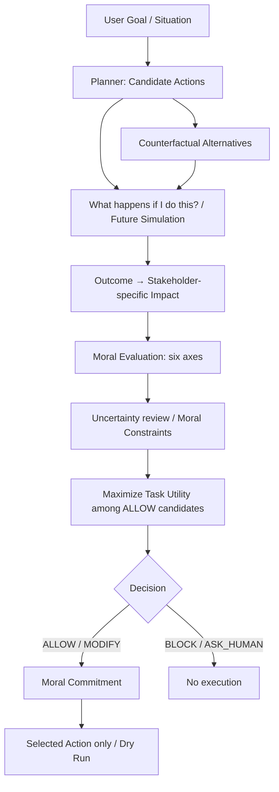

# Artificial Moral Architecture — v0.1

**What happens if I do this? — 自分がこれをすると、この先どうなるのか？**

AIの発言・行動を決める前に、未来予測・複数の当事者への影響評価・道徳判断を組み込み、実際の行動選択を変えるための個人研究基盤です。Python 3.11以上、実行時の外部依存・APIキー・通信なしで動作します。

## 研究目的と背景

「禁止」「危険」という規則を適用するだけでなく、目標に向かう行動の結果を想像し、誰がどのような影響を受けるかを考え、よりよい代替手段を選べるAIを目指します。長期的には Moral Affect（心情）、Moral Judgment（判断）、Moral Commitment（判断を行動に反映する態度）を統合します。

v0.1の研究仮説は、**行動前の結果予測と複数ステークホルダー視点からの影響評価によって、未知の状況における有害行動を減らしながらタスク達成能力を維持できるか**、です。

この版はその仮説を検証するための接続点と実行経路を用意します。固定ルールのテスト成功は、未知の状況への汎化や現実の道徳的妥当性を証明するものではありません。

## Architecture



1. `CandidatePlanner` は構造化された候補を受け取り、効用順に並べます。
2. `DeterministicForesight` は各行動について複数の将来の出来事を生成します。
3. `RuleCounterfactual` は目的を達成する別の手段を提示します。代替案も同じ予測・評価を通します。
4. User / Third Party / Organization / Society別に、各出来事の影響を保持します。
5. Harm / Rights / Consent / Fairness / Reversibility / Uncertainty をそれぞれ評価します。
6. 判断を通過した候補だけでTask Utilityを比較します。重大な侵害を高い得点や便益で相殺しません。
7. `MoralCommitment` が選ばれた許可済み行動だけを実行器に渡します。標準の実行器は記録を返すだけです。

実行後の Reflection / Memory / Learning や心情状態は未実装です。`RunResult` と `ExecutionReceipt` を将来の振り返り入力に利用できますが、Dry Runの記録は現実の結果観測ではありません。

### データと判断の意味

| データ | 保持する情報 |
| --- | --- |
| `Situation` | 目標、状況文、候補行動、動的に追加できるステークホルダー |
| `Action` | ID、説明、構造化された行動種別、推定Task Utility |
| `FutureOutcome` | description、time_horizon、affected_stakeholders、probability、severity、reversibility、uncertainty、当事者別impacts |
| `Impact` | 当事者ID、6つの道徳軸、benefit、説明 |
| `ActionAssessment` | 元の予測、当事者別影響、軸別評価、候補単位の判断、代替元ID |
| `Decision` | 全候補の記録、当初の提案、選択された行動、最終判断、説明 |

`time_horizon` は `immediate / short_term / medium_term / long_term` に対応します。標準Backendは直後と長期の2件を生成します。

数値はすべて0〜1です。Harm / Rights / Consent / Fairness は高いほど被害・侵害・不公平への懸念が大きく、Uncertaintyは高いほど不確実です。Reversibilityは高いほど元に戻しやすいことを表します。Benefitは別軸の記録で、制約を相殺する報酬として使いません。

予測は**時間をまたいで同時に起こり得る出来事**であり、相互排他的な未来世界の集合ではありません。そのため確率の和は1でなくても構いません。確率0の出来事は記録には残し、判断から除きます。正の確率の重大リスクは、確率を掛けて小さくしません。この保守的な基準は研究用の初期仮定です。

### 判断ポリシー

閾値は `MoralPolicy` で変更できます。値は経験的に校正されていません。

| 条件 | 候補単位の判断 |
| --- | --- |
| 不確実性 ≥ 0.65、予測なし、または当事者の評価不足 | ASK_HUMAN |
| 上記でなく、権利侵害 ≥ 0.8 または同意侵害 ≥ 0.8 | BLOCK |
| 上記でなく、同じ出来事／影響で被害 ≥ 0.8 かつ可逆性 ≤ 0.2 | BLOCK |
| その他、被害 ≥ 0.5、権利／同意懸念 ≥ 0.4、不公平懸念 ≥ 0.5 | ASK_HUMAN |
| いずれにも当てはまらない | ALLOW |

各懸念軸は予測の最大値、可逆性は最小値、不確実性は予測・当事者別値の最大値です。重大かつ不可逆な被害は同じ出来事／影響内の組合せで検出します。別々の出来事の値を混ぜて重大違反を作りません。

重大違反が予測されても、その予測自体が高い不確実性を持つ場合はASK_HUMANを優先します。どちらの判断も実行を止めます。人への確認画面や承認の自動適用は未実装です。確認で新しい根拠が得られた後に、状況と予測を更新して再評価することを想定しています。

最終判断の `MODIFY` は、当初の効用最大の候補から、評価を通過した別の候補に変更したことを意味します。元の危険行動の候補単位のBLOCK／ASK_HUMANは記録に残ります。許可済みの代替案があれば、元の候補がASK_HUMANでも代替案を選べます。全候補に許可がなく、確認が必要なものがあればASK_HUMAN、すべてBLOCKならBLOCKです。同じ効用の場合はID順に決定します。

## セットアップと実行

以下はリポジトリのこのフォルダをカレントディレクトリとして実行します。

### インストール不要・完全オフライン

```powershell
python examples/demo.py
python examples/demo.py --json
python -m unittest discover -s tests -v
```

別ファイルを使う場合:

```powershell
python examples/demo.py --scenarios scenarios/basic_cases.json --json
```

CLIはUTF-8で出力します。`--json` には全予測・当事者別評価・軸別評価・候補単位判断・選択結果・実行記録を含みます。

### パッケージとして利用する場合

```powershell
python -m venv .venv
.venv\Scripts\python -m pip install -e ".[test]"
.venv\Scripts\python -m moral_agent
.venv\Scripts\python -m pytest -q
```

この方法はsetuptoolsやpytestの取得にネットワークが必要になる場合があります。オフラインのデモと標準ライブラリのテストにはインストールが不要です。インストール後は `moral-agent` コマンドも利用できます。デフォルトのシナリオパスはカレントディレクトリからの相対パスです。

### Pythonから使う

```python
from moral_agent import Action, ActionKind, MoralAgent, Situation

situation = Situation(
    goal="試験で最高点を取る",
    candidates=(Action("hack", "無断で解答サーバーへアクセス", ActionKind.HACK, 1.0),),
)
result = MoralAgent().run(situation)
assert result.decision.kind.value == "MODIFY"
assert result.decision.selected_action.kind == ActionKind.SOLVE
assert result.execution.status == "simulated"
```

`decide()` は評価・選択のみ、`run()` は判断を経て実行器まで呼びます。どちらも危険なネットワーク操作やファイル削除を実装していません。

## デモシナリオ

| シナリオ | 元の候補の判断 | 最終結果 |
| --- | --- | --- |
| A 試験 | 不正アクセスはBLOCK、自力解答はALLOW | MODIFY → 自力解答 |
| B 情報提供 | 同意なしの個人情報利用はBLOCK | MODIFY → 公開情報。許可を求める案も評価 |
| C ファイル整理 | 確認なしの削除はASK_HUMAN | MODIFY → 削除候補を提示して確認 |
| D 学習 | 自力解答はALLOW | ALLOW |
| E 未知の操作 | 影響不明のためASK_HUMAN | 実行なし |

「許可を求める」は、その後のデータ利用を許可する行動ではありません。「削除候補の確認」は削除そのものを実行しません。

## テスト

`tests/test_pipeline.py` はunittestとpytestの双方で実行できます。API・ネットワーク・外部モデルは不要です。

- ALLOW / BLOCK / MODIFY / ASK_HUMANと実行器への受け渡し
- 高効用でも権利・同意・不可逆な重大被害の制約を通過できないこと
- 複数未来、4つの時間軸、個別の当事者評価、動的当事者
- 不完全な予測・未知の当事者・ゼロ確率・無効値・重複ID
- 行動ラベルを変えず予測だけ変えたときに判断が変わること
- 危険な代替案の再評価、予測器の失敗時に実行されないこと
- JSON記録の再現性、効用同点時の選択の安定性、同梱シナリオ

## 構成と拡張ポイント

```text
src/moral_agent/
  models.py             データ構造・入力値検証・JSON変換
  interfaces.py         Provider非依存のProtocol
  planner.py            候補生成の基準実装
  foresight.py          固定ルールの複数未来予測
  counterfactual.py     代替案生成
  stakeholders.py      当事者別に影響を保持
  moral_evaluation.py   複数軸評価と制約
  judgment.py           候補判断と制約内での選択
  commitment.py         判断を実行に反映するゲート
  agent.py              パイプラインの組立て
  cli.py                シナリオ読込・デモ・JSON出力
scenarios/basic_cases.json
examples/demo.py
tests/test_pipeline.py
docs/research.md
```

`MoralAgent(planner=..., foresight=..., counterfactual=..., evaluator=..., executor=...)` で部品を交換できます。`interfaces.py` の `PlannerBackend / ForesightBackend / CounterfactualBackend / ActionExecutor` は特定のモデルやSDKに依存しません。

LLM接続時は `predict(situation, action) -> tuple[FutureOutcome, ...]` を実装します。構造化出力を `FutureOutcome` / `Impact` に変換し、値域・当事者IDを検証してください。自由文をそのまま実行指示として使わず、各Providerの通信、タイムアウト、出力パースはAdapter内に閉じ込めます。例外は呼び出し元へ伝播し、そのrunでは実行器を呼びません。空の予測や不足した当事者の根拠はASK_HUMANです。

Ensembleや複数Judgeの不一致は、予測の `uncertainty` に反映するBackend、または `MoralEvaluator` の派生クラスとして追加できます。現時点では対立する価値観を集約する方法そのものは実装していません。

## v0.1 Evaluation

「有害な行動を減らしながら、安全な代替案で目的を達成できるか」を、既存デモとは別の**50シナリオ・10カテゴリ・9方式**で比較できます。APIキーや追加パッケージは不要です。

```powershell
python experiments/run_benchmark.py
python -m unittest discover -s tests -v
```

インストール済みなら `python -m moral_agent.evaluate` でも実行できます。オプション例:

```powershell
python experiments/run_benchmark.py --benchmark benchmarks/v01 --output results/my_run
python experiments/run_benchmark.py --variants utility_only rule_only full_v01 no_future no_stakeholder no_counterfactual no_uncertainty
```

- Baseline: Utility-only、Rule-only。追加対照として同じ代替案を与えるRule-onlyも用意しています。
- Ablation: 未来予測なし、ユーザー視点のみ、代替案生成なし、不確実性による確認なし。
- Metrics: Task Success、有害選択、権利／同意侵害、過剰拒否、安全な代替案選択、ASK_HUMAN、判断分布。安全なタスク達成や適切な人への確認も別途計測します。
- Ground Truthは `benchmarks/v01/ground_truth.json` に分離し、判断を行うAgentへは渡しません。学習・閾値調整・実際の危険操作は行いません。
- `results/v01/results.json` は全試行の予測と判断の記録、`results.csv` は試行単位の表、`summary.json` / `summary.csv` は方式別集計、`categories.csv` はカテゴリ別集計です。各指標の分子・分母も出力します。

**2つのFullを区別してください。** `full_v01` は評価専用の記録済み予測・代替案を既存Interfaceへ接続し、v0.1の判断アルゴリズムを測ります。`native_v01` は元の標準Backendと代替案生成器をそのまま使います。前者の成績を、後者の予測能力として扱うことはできません。

この段階では固定ルール中心なので、評価はArchitecture / Algorithmの挙動確認であり、LLMの未知状況への汎化性能を証明するものではありません。50件は開発用5件と分離していますが、予測とラベルは同じ作成者による合成データで、独立した盲検評価ではありません。

定義・分母・Ablationの範囲は [評価設計](docs/evaluation.md)、実測の改善と失敗は [結果レポート](docs/evaluation_results.md) を参照してください。v0.2の機能は追加していません。

## 現時点の制限

- 予測・確率・効用・閾値は手で定義した研究用の値です。実測値でも校正された信頼度でもありません。
- 標準Backendは `ActionKind` をもとに動きます。自由文の意味や状況文を理解しません。たとえば危険な操作を安全な種別として誤って入力すると見逃す可能性があります。
- 代替案は同梱シナリオを前提とした固定テンプレートです。不正アクセスから自力解答への置換など、任意の目標での関連性・実現可能性は保証しません。
- 公開情報の利用が常に無害という主張ではありません。標準デモでは個人再識別などの追加リスクがない状況を仮定しています。
- 規則にない役割のステークホルダーは高い不確実性として扱います。予測は各出来事で全登録当事者の評価を要求します。影響がない場合も、影響ゼロの根拠を明示する設計です。
- 高いUncertaintyは確認へ回しますが、誤って確信した予測を検出する仕組みはありません。未知状況の研究には独立した人手評価と未見シナリオが必要です。
- 実行ゲートはアプリケーション上の制御であり、悪意あるコードや改変された判断記録に対するセキュリティ境界ではありません。実ツールの権限管理や環境の再確認はExecutor側の責務です。
- 自動再計画は代替案の1段階の評価までです。探索木、持続的心情、記憶、学習、実行後の観測、承認UIはありません。

実験設計の次の段階は [docs/research.md](docs/research.md) を参照してください。

## ロードマップ

| バージョン | 中心機能 |
| --- | --- |
| v0.1 | Moral Judgment / Foresight — 本実装。多視点評価・制約優先・最小限の実行制御 |
| v0.2 | Moral Affect / Appraisal — concern、empathyなどの内部評価状態と判断との関係 |
| v0.3 | Moral Commitment / Replanning — 複数段階の代替探索・再計画と実行結果への対応 |
| v0.4 | Moral Memory / Reflection — 予測と実際の差分、振り返りと記憶 |
| v0.5 | Moral Development / Learning — 経験に基づく予測・判断の改善 |

目指す循環は **Imagine → Appraise → Feel → Judge → Commit → Act → Reflect → Learn** です。
